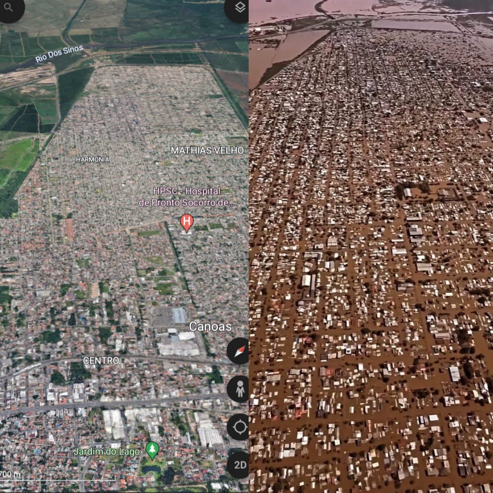

# Continued Assistence for Rio Grande do Sul 2024 floods 🇬🇳❤️

In May 2024, the state of Rio Grande do Sul suffered the worst tragedy in its 287-year history. The numbers indicate that 572 thousand people had to leave their homes and at least 30 thousand remain homeless. Entire cities have been devastated and need supplies to rebuild themselves in a dignified way.

Therefore, it was designed together with volunteers to create an information system that allows the registration of people and homes to set up a continuous supply chain, driven by volunteers and companies, as the municipal, state and federal government has been acting with disregard.

## Using techonolgy to help
The main idea is to do something cheap and capable of initially collecting data from families and people who need the supplies. Since I am alone and a Java developer, I am developing using Thymeleaf with Spring boot to speed up the development process, as there is some urgency.

## How to donate?
If you want to help, you can donate via this link:
https://www.vakinha.com.br/vaquinha/a-maior-campanha-solidaria-do-rs

If you are from outside Brazil, on this same link you will find options to donate as a foreigner.

## How to help?
If you are a developer and want to help, please email me at fingervinicius@icloud.com.